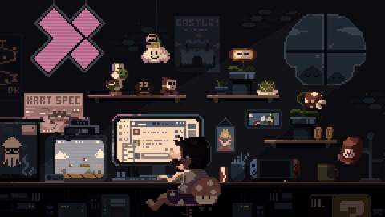

<h3 align="center"></h3>
<h3 align="center">I am currently a full-stack developer.</h3>

```
Graduado de Análise e desenvolvimento de Sistemas - UNA Belo Horizonte,
atualmente tenho me dedicado a me tornar um dev fullstack.
🔭 Estudando: React e React Native
```
<div align="center">
  <a href="https://github.com/PedroIsidorio29">
  
  
</div>
  
  <h4 style="display: inline_block" align="center">
  Algumas tecnologias com que já trabalhei.
  <h4>
  
<div style="display: inline_block" align="center" >
  
  
  
  
  
  
  
  
  
  
  
  
  
  
  
  
  
  
  
  
  
  
  
  
  
 </div>
  
 ##
  
<div align="center">
  <a href = "mailto:pedroisidorio1@gmail.com"></a>
  <a href="https://www.linkedin.com/in/pedro-isidorio-souza-4a4b471a2/" target="_blank"></a> 

  
  
</div>
