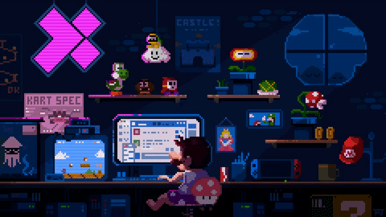

<h3 align="center"></h3>
<h3 align="center">Full-stack developer.</h3>

```
Atualmente trabalhando como desenvolvedor Front-End.
Cursando Engenharia da Computação - Descomplica.
Formado em ADS - UNA Belo Horizonte.
Resolvendo problemas desde 2021
🔭 Estudando: Docker
```

  
  <h4 style="display: inline_block" align="center"> Some technologies I've worked with. <h4>
  
<div style="display: inline_block" align="center" >
  
  
  
  
  
  
  
  
  
  
  
  
  
  
  
 </div>
  
 ##
  
<div align="center">
  <a href = "mailto:pedroisidorio1@gmail.com"></a>
  <a href="https://www.linkedin.com/in/pedro-isidorio-souza-4a4b471a2/" target="_blank"></a> 

  <!---->
  
</div>
